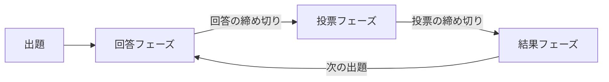

# bǃgǃrǃ ユーザーマニュアル

**対象:** バージョン 1.138.3（2026年9月19日公開）  
**作成日:** 2026年9月25日

bǃgǃrǃ（ビギリ）は、ブラウザーで部屋を開き、大喜利の出題、回答、投票、結果発表を繰り返すサービスです。このマニュアルは更新情報を基に、現在の画面で行う操作を参加者と部屋作成者の両方に向けて説明します。画面に表示される設定によって、使えるボタンやタイミングは変わります。

## 1. まず一回参加する

1. トップ画面の「サインイン」を開きます。名前で始める場合は「新規サインイン」を押し、名前を設定します。Twitter または Bluesky のアカウントでもサインインできます。
2. 部屋一覧から参加したい部屋の「入室する」を押します。パスワードを求められたら、部屋作成者から聞いたものを入力します。グループ選択画面が出た場合は所属先を選びます。
3. 部屋の「メイン」でフェーズとお題を確認します。回答フェーズでは「回答する」、投票できる時期には各回答の「投票する」を押します。
4. 結果フェーズで順位を見ます。必要に応じてコメントやリアクションを送り、次のお題を待ちます。

操作できないときは、まず画面上部のフェーズ名、円形タイマー、部屋の設定表を確認してください。回答数や投票数の上限、参加者ごとの権限も影響します。

### 一回の流れ

回答と投票は部屋作成者が手動で締め切れます。時間制限がある部屋では、その経過でもフェーズが進みます。回答表示と投票表示がともに「即時」の部屋では、回答フェーズ中から公開済みの回答へ投票できます。

| 役割 | 主な操作 |
|---|---|
| 入室者 | 部屋のルールと権限が許す範囲で出題、回答、投票を行う |
| 部屋作成者 | 部屋の作成と削除、フェーズの締め切り、入室者とグループの管理、部屋コメントの投稿 |
| 出題者・回答者・投票者 | それぞれの操作が許可された入室者。部屋設定や個別指定で決まる |

## 2. サインインと名前

### サインイン方法

| 方法 | 操作 | 特徴 |
|---|---|---|
| 名前で始める | 「新規サインイン」→名前を入力→「設定する」 | 外部アカウントは不要。初期名は「お客さん」。必要に応じて reCAPTCHA の確認が入る |
| Twitter | 「Twitterでサインイン」→認証画面で許可 | ソーシャルサインインとして扱われる |
| Bluesky | 「Blueskyでサインイン」→ハンドルを入力→認証画面で許可 | OAuth によるソーシャルサインイン。ハンドル欄には通常、先頭の `@` を除いた文字を入力する |

ソーシャルサインインは、出題者・回答者・投票者を「ソーシャルサインイン」に限定した部屋でも対象になります。プロフィール画像を取得できないときは既定の画像が表示されます。Twitter サインインの画面遷移には一時的な変更が行われており、表示が変わる場合があります。

### 名前と公開リンク

- トップ画面では、メニューの**自分の名前そのもの**を押すと、サインイン時の名前を変更できます。
- 部屋では、メニューバーの**自分の名前そのもの**を押すと「名前やリンクを変更する」が開きます。ここで変えた名前はその部屋にだけ適用されます。名前欄を空にするとサインイン時の名前が使われます。
- 同じ画面の「リンク」は「無し」または「有り（URL）」を選びます。設定したリンクは入室者一覧に表示されます。部屋で名前を変えたり、名前にハッシュ値を付けたりしても、リンクが自動的に非表示になることはありません。
- 名前に `#` と任意の文字列を付けると、`#` より後ろは8文字のハッシュ値に変換されて表示されます。同じ文字列を使えば同じ表示になり、同名の利用者を見分ける手がかりになります。元の文字列は表示されません。

出題者名や回答者名などを押すと、名前と、その入室者に割り当てられた8文字のトークンを切り替えて確認できます。同名の人を識別したいときに使います。

### 端末を変える、利用を終える

「サインオーバー」はサインイン状態を別のブラウザーへ引き継ぐ機能です。トップ画面または部屋のメニューで開き、表示されたリンクを「URLをコピーする」でコピーするか、QRコードを読み取ります。**1時間以内**に引き継ぎ先で開き、確認画面でサインインしてください。引き継ぎ用リンクは他人に渡さないでください。

サインアウトはトップ画面の「サインアウト」から確認して実行します。名前だけで始めたサインイン状態は、サインアウト後に同じ状態へ戻せません。部屋からだけ離れる場合は、部屋メニューの「退室する」を使います。

## 3. トップ画面と部屋への入室

トップ画面には更新情報、使用方法、部屋一覧があります。「全更新情報を見る」で更新履歴を確認できます。使用方法にはマニュアルと意見・質問用の GitHub ディスカッションへの案内があります。

部屋一覧の表示順は「作成順」と「更新順」から選べます。どちらも新しい日時の部屋が先頭です。並べ替えの近くにある手の形のボタンをオンにすると、**自分が入室している部屋だけ**に絞り込めます。オンのアイコンは塗りつぶしで表示されます。

各部屋のカードでは、部屋名、説明、アイコン、作成者、各種設定、更新日時、入室者などを確認できます。Twitter と Bluesky の共有・検索用ボタンもあります。自分の名前は一覧で区別できる表示になります。「入室する」を押すと部屋へ移動します。

パスワード制限のある部屋では、入室時にパスワード入力画面が出ます。グループが作成されている部屋では、未所属の場合にグループ選択画面が表示されます。部屋内の「グループを選択する」から後で変更できます。

トップ画面には、部屋内で個別の注記がない作品に適用される **Creative Commons 表示 4.0 国際** の案内もあります。作品を再利用するときは、その部屋の注記とライセンスを確認してください。

## 4. 部屋を作る

サインイン後、トップ画面の「部屋を作成する」を押し、部屋名、説明、画像、ルールを設定して作成します。作成画面には前回の設定が初期値として入り、アイコン画像も引き継がれます。設定は作成前に確認してください。

名前だけの新規サインインでは、**まだ一度も出題していない部屋を同時に持てるのは1つ**です。その部屋で最初のお題を出すと次の部屋を作れます。ソーシャルサインインでは未出題の部屋を複数作れます。

部屋名の横の「履歴を見る」には、同じブラウザーで過去に作成した部屋の設定が保存されています。履歴から読み込み、または履歴を削除できます。同名の部屋を作成した場合は最新の設定だけが残ります。履歴は部屋自体の一覧ではなく、再作成に使う設定の控えです。

部屋作成者はトップ画面の部屋カードから「部屋を削除する」を選べます。部屋の存続期間は**最終更新日時から11.5日間**です。継続利用する部屋でも、記録を残したいときは早めにログを取得してください。

### 部屋設定：基本と出題

| 項目 | 内容と選び方 |
|---|---|
| 部屋名・説明 | 部屋の目的や進行方法を伝えます。説明中の URL はリンクとして表示されます |
| アイコン画像 | 部屋一覧と部屋画面に表示。容量制限を超えた画像や無効な画像は設定できません |
| カラースキーム | 「無し」はブラウザーや OS に従い、「ライト」「ダーク」は部屋の既定の配色になります |
| 入室制限 | 「有り（パスワード）」を選ぶと入室時にパスワードを要求します |
| 出題優先時間 | 「無し」「有り（部屋作成者）」「有り（首位回答者）」から選び、後者2つには秒数を指定します。結果フェーズで次の出題者を一定時間優先します |
| 出題者制限（初期値） | 「無し」「有り」「有り（ソーシャルサインイン）」から選びます。個別指定との関係は後述します |
| 出題画像制限 | 「有り（禁止）」にするとお題へ画像を添付できません |
| 出題コメント制限 | 「有り（部屋作成者）」にすると出題へのコメント・リアクションを部屋作成者に限ります |

### 部屋設定：回答

| 項目 | 内容と選び方 |
|---|---|
| 回答表示 | 「即時」は投稿後すぐ公開。「一斉」は投票フェーズまで他の人の回答を隠します |
| 回答時間制限 | 「有り」で回答フェーズの秒数を指定します |
| 回答シャッフル時間 | 指定秒数以内の回答を、投票フェーズで入室者ごとにランダムな順で表示します。「有り」で秒数欄を空にすると全回答が対象です。結果の順位には影響しません |
| 回答数制限 | 1人が一つのお題に送れる回答数を指定します |
| 回答者名表示 | 「表示」「非表示」「一斉（結果フェーズまで非表示）」から選びます |
| 回答者制限（初期値） | 回答できる人の初期条件です。出題者制限と同じ3択です |
| 回答コメント制限 | 「有り（部屋作成者）」で回答へのコメントを部屋作成者だけにします |
| 回答描画制限 | 「有り（禁止）」で手描きの線画を付ける機能を使えなくします |

### 部屋設定：投票

| 項目 | 内容と選び方 |
|---|---|
| 投票表示 | 「即時」は票がすぐ反映されます。「一斉」は結果フェーズまで票を隠し、投票フェーズから投票可能にします |
| 投票時間制限 | 「有り」で出題ごとの基本秒数と回答1件あたりの秒数を設定します。合計時間は **基本秒数 ＋ 回答数 × 回答ごとの秒数** です |
| 投票数制限（出題毎） | 一つのお題について1人が投票できる合計を指定します。「有り（超過可）」は投票画面から上限を超える操作を認めます |
| 投票数制限（回答毎） | 1人が一つの回答に入れられる票数の上限です |
| 投票者名表示 | 「表示」「非表示」「一斉（結果フェーズまで非表示）」から選びます |
| 投票者制限（初期値） | 投票できる人の初期条件です。出題者制限と同じ3択です |
| 投票グループ制限 | 「無し」「有り（自グループに投票）」「有り（次グループに投票）」から選びます。グループの章で詳しく説明します |

たとえば投票時間を「出題毎 60秒、回答毎 2秒」とし、対象回答が20件なら、投票時間は **60＋20×2＝100秒** です。投票グループ制限を使うと、回答数には全体の件数ではなく、表示対象が最多となるグループの件数が使われます。

### 出題者・回答者・投票者制限の共通ルール

| 初期値 | 最初に操作できる人 |
|---|---|
| 無し | 入室者全員 |
| 有り | 誰もいません。部屋作成者が入室者一覧で対象者を追加します |
| 有り（ソーシャルサインイン） | 対応するソーシャルアカウントでサインインした人 |

部屋作成者が「入室者を見る」で誰かを出題者・回答者・投票者へ**個別に追加した場合、その種類の権限は追加された人の一覧で決まります**。初期値による条件はその種類について適用されなくなります。部屋作成者自身も自動では含まれないため、「有り」を選んだ部屋で自分が操作するなら自分を追加してください。個別指定を全員分取り消すと初期値に戻ります。

回答者名や投票者名を隠す設定でも、**自分自身の回答・投票に付く自分の名前は自分には表示**されます。

## 5. 部屋の画面を読む

メニューバーの「メイン」には現在のお題が表示されます。「過去の結果」で以前の回を見られ、「ログ（CSV）」で記録をダウンロードできます。メニューバーの名前から部屋内の名前と公開リンクを設定し、「退室する」で部屋から離れられます。自分が獲得した🦄の累計も名前の近くに表示されます。

部屋の上部には部屋名、説明、共有ボタン、設定表、「グループを選択する」「入室者を見る」があります。設定表は操作の可否を判断する基準です。部屋作成者はここに部屋コメントを投稿し、会の案内を表示できます。

メニューバーの配色ボタンでは「オート」「ライト」「ダーク」を選べます。ここでの選択はその場限りで保存されません。オートはブラウザーや OS の設定に従います。

## 6. お題を出す

部屋にまだ出題がないとき、または結果フェーズでは、出題権のある人に「出題する」が表示されます。出題者制限と出題優先時間によっては、ボタンが押せません。

1. 「出題する」を押します。
2. 出典がある場合は「出典」に入力します。画像を付ける場合は「画像有り」からファイルを選びます。出題画像制限がある部屋では画像を付けられません。
3. お題の本文を入力します。上限は**1500文字**です。複数行入力欄は行数に応じて伸びます。
4. 「出題する」を押して送信します。入力欄では **Ctrl＋Enter** または **Commandキー／Windowsキー＋Enter** でも送信できます。

お題に他者の著作物を使う場合は、利用条件を確認し、必要な出典を示してください。出題画像は白い背景で表示され、画像を押すと拡大できます。お題が10行または150文字を超える場合は途中で折りたたまれ、残り文字数のボタンで開けます。

### 出題優先時間

結果フェーズの開始後、設定した秒数だけ次の出題者を優先できます。「部屋作成者」なら作成者だけ、「首位回答者」なら**その回で投票した回答者のうち、最も順位の高い回答を書いた人**が優先されます。該当者がいないときは優先による制限はありません。優先時間が終われば、通常の出題者制限に従います。

優先時間中は「出題する」の横にタイマーが表示され、出題できない人のタイマーは赤色になります。「首位回答者」を選んだ部屋では、優先される回答者の**名前が明滅**します。部屋作成者は「出題優先を締め切る」で途中終了できます。

## 7. 回答する

回答フェーズで「回答する」を押し、本文を入力して送信します。上限は**1500文字**です。出題と同じく Ctrl＋Enter または Commandキー／Windowsキー＋Enter で送信できます。回答時間制限がある部屋では、画面と入力画面の円形タイマーを確認してください。

回答描画が許可されている場合は「描画有り」を押し、表示されたキャンバスへマウス、指、ペンで線を描けます。元に戻す・やり直すボタンで線を調整し、文章と一緒に投稿します。「描画無し」で外せます。投稿された線画は回答カード上で拡大して見られます。

回答表示が「一斉」の部屋では、回答フェーズ中に自分の回答を**変更**または**削除**できます。変更すると回答時刻も更新されます。削除した回答の内容は、次に回答画面を開いたとき入力欄へ戻る場合があります。回答数制限に達すると、新しい回答は送れません。

回答カードには回答者名、回答番号、本文または線画、得票数などが表示されます。長い回答はお題と同様に折りたたまれます。回答者名の表示時期は部屋設定に従います。自分の名前は自分の画面で確認できます。

## 8. 投票する

投票可能な回答の「投票する」を押すと、回答と票数ボタンが表示されます。**＋**で増票、**－**で減票し、「投票する」で確定します。すでに投票した回答では「投票を変更する」から票数を変えられ、投票の削除もできます。投票数の初期値は状況により変わるため、送信前に数字を確認してください。

投票画面では最初から票数ボタンにフォーカスが当たります。この状態で **スペース**は増票、**Delete**は減票、**Enter**は送信です。**Esc**でダイアログを閉じられます。投票数ボタンをドラッグして票数を変える旧操作は使えません。

「投票する」の横にある **👍0** は、投票画面を開かずに0票を投票するボタンです。投票した回答は「投票を見る」で確認できます。この画面には投票数の合計が表示され、出題ごとの上限がある場合は合計の横に上限も示されます。

| 回答表示 | 投票表示 | 投票できる時期 |
|---|---|---|
| 即時 | 即時 | 回答フェーズ中、公開された回答から |
| 即時 | 一斉 | 投票フェーズから |
| 一斉 | 即時または一斉 | 投票フェーズから |

回答表示と投票表示がともに即時の部屋で投票時間制限がある場合、各回答の投稿時刻がその回答への投票時間の起点です。それ以外は投票フェーズの開始時刻を基準にします。

出題ごとの投票数制限に達すると、未投票の回答では「投票する」の代わりに「投票を見る」が表示されます。既存の投票を変更・削除して票を移せます。「有り（超過可）」の部屋では、投票画面内で合計の上限を超えて増票できます。回答ごとの上限は別に適用されます。

各回答の得票数を押すと、その回答に対する**自分の投票だけ**を表示できます。回答に付いた投票は票数の多い順に並び、同票なら投票した順です。投票者名を表示するかどうかは部屋設定に従います。

## 9. 結果と順位

投票が締め切られると結果フェーズになり、回答の順位が表示されます。順位はまず**得票数**の多い順です。同票の場合は回答者自身が投票した票数の多い方、それも同じなら早く回答した方が上位になります。回答シャッフルの表示順は順位に影響しません。

順位を押すと、その回答の **Zスコア** を小数点以下4桁で確認でき、もう一度押すと順位に戻ります。Zスコアの計算には、得票数に回答者自身の投票状況による補正を加えた値が使われます。その回の回答の平均からどの程度離れたかを示します。**順位の決め方とZスコアの計算は異なります。**

| Zスコア | 順位の見え方 |
|---|---|
| 2以上 | 🦄が付く。3以上なら2個、さらに1上がるごとに増える |
| 1以上 | 順位に下線が付く |
| −1以下 | 順位に上線が付く |
| −2以下 | 🍦が付く。さらに1下がるごとに増える |

🦄の獲得数は部屋ごとに累計され、メニューバーと入室者一覧で確認できます。結果フェーズではコメント、リアクション、回答の並べ替え・絞り込み、次の出題ができます。

## 10. コメント、リアクション、探し方

| 種類 | 投稿できる人と時期 | 表示場所 |
|---|---|---|
| 部屋コメント | 部屋作成者がいつでも投稿できる | 部屋上部。部屋作成者は最新の1件を削除できる |
| 出題コメント | 結果フェーズに、部屋設定で許可された人が投稿できる | お題の近く |
| 回答コメント | 結果フェーズに、部屋設定で許可された人が投稿できる | 各回答の下 |

「コメントする」を押して文章を送ります。出題・回答コメントは投稿後に削除できません。コメントの中の URL はリンクとして表示されます。リアクションは「コメントする」の横のスマイルボタンから絵文字を選ぶ操作で、絵文字のコメントをすぐ投稿できます。出題と回答の両方で利用でき、選べる絵文字は更新で入れ替わります。

### 回答の並べ替え

回答一覧の上のドロップダウンで、**設定順・先着順・後着順・上位順・下位順**を選べます。結果フェーズと過去の結果では、コメント数による**多コ順・少コ順**も使えます。「設定順」は部屋の設定やフェーズに応じた既定の順です。回答シャッフル時間がある場合の投票フェーズでは、対象の回答が入室者ごとに異なる順番になります。

### 絞り込み

| 操作 | 表示されるもの |
|---|---|
| ✋ 自回答フィルター | 自分が投稿した回答 |
| 👍 自投票フィルター | 自分が投票した回答 |
| ☝ 自コメントフィルター | 自分がコメントした回答 |
| グループ名を押す | そのグループの回答 |
| 👁 回答ピックアップ | 選んだ一つの回答 |
| 回答の得票数を押す | その回答に付いた自分の投票 |

自回答・自投票・自コメントは**プライマリーフィルター**で、同時に一つを選びます。グループと回答ピックアップは**セカンダリーフィルター**で、選んだプライマリーフィルターの結果をさらに絞ります。プライマリーを切り替えるとセカンダリーは解除されます。フィルターのアイコンは塗りつぶしがオンです。使えるフィルターはフェーズにより異なり、自コメント、グループ、回答ピックアップは結果フェーズと過去の結果で使えます。

## 11. グループを使う

グループは部屋内だけで有効です。部屋作成者は「グループを選択する」画面からグループを作成・削除できます。名前は重複または空欄でも作成でき、説明も付けられます。グループ名の「履歴を見る」では同じブラウザーで作った設定を読み込み・削除できます。同名の履歴は最新のものが残ります。

参加者は「グループを選択する」で所属先を選びます。画面にはグループの説明、人数、所属者が表示されます。グループがある部屋へ新たに入室した場合や、所属グループが削除された場合には選択画面が表示されます。選んだグループはメニューバーにも表示されます。

「投票グループ制限」は投票フェーズで見える回答を決めます。

| 設定 | 投票フェーズで見える回答 |
|---|---|
| 無し | すべての回答 |
| 有り（自グループに投票） | 自分と同じグループの回答 |
| 有り（次グループに投票） | 自分のグループの次に作成されたグループの回答。自分が最後のグループなら最初のグループの回答 |

グループ未選択の人には、未選択の人の回答が表示されます。部屋にグループが一つもなければ、投票グループ制限を設定しても「無し」と同じ動作です。結果フェーズと過去の結果では回答にグループ名が表示され、その名前からグループフィルターを使えます。

## 12. 部屋作成者の進行と管理

部屋作成者は回答フェーズで「回答を締め切る」、投票フェーズで「投票を締め切る」を使えます。結果フェーズでは出題優先時間を途中で締め切れます。制限時間がある場合も、手動締め切りで先に進められます。

「入室者を見る」には、名前、公開リンク、プロフィール画像、🦄の累計、8文字のトークンなどが表示されます。退室した人は薄く、受刑者は取り消し線付きで表示されます。表示順は次から選べます。

| 表示順 | 基準 |
|---|---|
| 先入順・後入順 | 入室日時 |
| 多🦄順・少🦄順 | 🦄の累計 |
| 昇名順・降名順 | 名前 |
| 昇Di順・降Di順 | ディスクリミネーター（トークン） |
| 古サ順・新サ順 | サインイン日時 |

部屋作成者は各入室者を出題者・回答者・投票者へ追加したり、そこから削除したりできます。画面幅が狭い場合は「⋯」から操作ボタンを開きます。問題のある入室者は「受刑者へ追加する」で強制退室となり、部屋へ参加できなくなります。自分自身は受刑者にできません。

## 13. 過去の結果と記録

部屋の「過去の結果」では、以前の回の順位、回答、コメントなどを閲覧できます。ページ切り替えで回を選び、並べ替えとフィルターも使えます。対象は**34.5日以内の出題**です。過去の結果は閲覧用で、新たな投票やコメントの投稿はできません。

「ログ（CSV）」では、部屋に入室した状態で表示されるダウンロード用リンクを押します。サーバーが準備している間は処理中の表示が出ます。「ディスクリミネーター付き」をオンにすると、同名の入室者を区別できる形式になります。グループ名は9番目の項目に出力されます。ダウンロード対象も**34.5日以内の出題**です。部屋の存続期間はそれより短いため、保存したい記録は早めに取得してください。

## 14. 困ったとき

| 状況 | 確認すること |
|---|---|
| 部屋を作れない | 新規サインインで未出題の部屋をすでに1つ持っていないか確認します。その部屋で出題すると次を作れます |
| 部屋が一覧にない | 自入室フィルターを解除し、並べ替えを確認します。最終更新から11.5日を超えた部屋は存続期間が終わります |
| 入室できない | パスワード制限があれば作成者に確認します。受刑者に設定された人は入室できません |
| 「出題する」が押せない | 結果フェーズか、出題者権限があるか、出題優先時間中かを確認します |
| 「回答する」が押せない | 回答フェーズか、時間切れでないか、回答者権限と回答数制限を確認します |
| 他の人の回答が見えない | 回答表示「一斉」なら投票フェーズまで待ちます。投票グループ制限やフィルターも確認します |
| 「投票する」が「投票を見る」になった | 出題ごとの投票数上限に達しています。既存の投票を変更または削除します |
| 画面が明るい・暗い | 部屋メニューの配色ボタンで切り替えます。選択は保存されません |
| 表示が更新されない | ブラウザーを再読み込みし、必要なら新しいブラウザーで開きます |

ダイアログは **Esc** でも閉じられます。処理中は実行ボタンにスピナーが重なって表示されます。最近のブラウザーでの利用を想定しており、古いブラウザーでは表示や操作が正常にならない場合があります。

## 15. 最近変わった操作

| 更新 | 現在の使い方 |
|---|---|
| 1.138.3 | リアクションの絵文字を一部変更。絵文字の固定一覧は前提にしないでください |
| 1.138.0 | 設定名は「首位回答者」。優先時間中は該当回答の回答者名が明滅します |
| 1.137.2 | トップ画面の案内が「更新情報」と「使用方法」に分かれています |
| 1.137.0 | 名前で始める入口は「新規サインイン」です |
| 1.136.0 | 入室者の並べ替えに「古サ順」「新サ順」が加わりました |
| 1.135.0 | 部屋一覧に自入室フィルターが加わりました。入室者一覧の新規登録者マークは廃止されました |
| 1.134.0 | 回答ごとの自投票フィルターと、プライマリー・セカンダリーの絞り込みが加わりました |
| 1.128.0 | 「名前を変更する」という独立メニューはなくなり、表示された名前を押して変更します |
| 1.126.0 | 👍0による0票クイック投票と、入力画面の新しいキーボード操作が加わりました |
| 1.115.0 | 以前の「グループ外に投票」は、現在の「次グループに投票」へ変更されました |

以前の案内にある Discord 通知、初期グループの設定、称号、回答開始時間制限、投票数のドラッグ操作、回答ヘッダーを押してスクロールする操作は、現在の画面では使いません。操作に迷ったら、部屋の設定表と現在表示されているボタン名を基準にしてください。

---

このマニュアルは更新情報と画面表示を基に作成しました。画面の表示と異なる場合は、現在の画面を優先してください。
