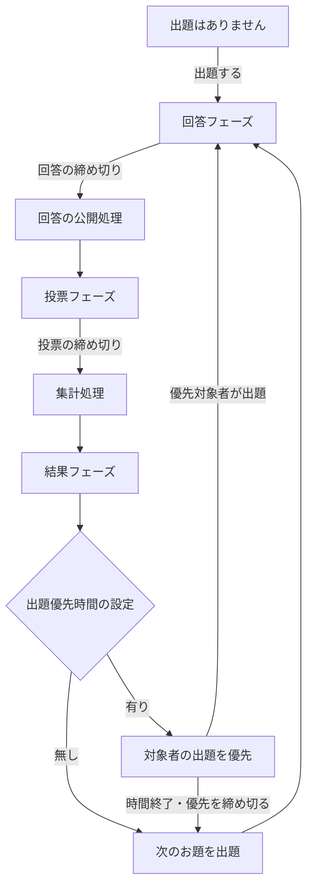

# bǃgǃrǃ ユーザーマニュアル

作成日：2026年9月30日  
対象バージョン：1.138.4（2026年9月26日公開）

本書は、bǃgǃrǃ（びぎり）のリリースノートをもとに、現在の画面表示と操作を確認してまとめた利用ガイドです。参加者の操作と部屋作成者の運営方法を説明します。ボタンの表示や操作できる範囲は、部屋の設定、参加者の権限、現在のフェーズによって変わります。

## 目次

1. [はじめに](#1-はじめに)
2. [初めて参加する](#2-初めて参加する)
3. [サインインと名前の設定](#3-サインインと名前の設定)
4. [部屋を探す・入室する・退室する](#4-部屋を探す入室する退室する)
5. [大喜利の進み方](#5-大喜利の進み方)
6. [お題を読む・回答する](#6-お題を読む回答する)
7. [投票する](#7-投票する)
8. [結果と順位を読む](#8-結果と順位を読む)
9. [表示順とフィルターを使う](#9-表示順とフィルターを使う)
10. [コメントとリアクション](#10-コメントとリアクション)
11. [グループを利用する](#11-グループを利用する)
12. [過去の結果とログの保存](#12-過去の結果とログの保存)
13. [部屋を作成する](#13-部屋を作成する)
14. [出題と進行を管理する](#14-出題と進行を管理する)
15. [参加者の権限を管理する](#15-参加者の権限を管理する)
16. [設定履歴を再利用する](#16-設定履歴を再利用する)
17. [表示とキーボード操作](#17-表示とキーボード操作)
18. [困ったときの確認事項](#18-困ったときの確認事項)
19. [運営例](#19-運営例)
20. [最近の変更と問い合わせ](#20-最近の変更と問い合わせ)

## 1. はじめに

bǃgǃrǃは、ウェブブラウザーで出題・回答・投票を行う大喜利サービスです。トップ画面で部屋を選び、入室して参加します。部屋ごとに回答の公開方法、制限時間、投票数、名前の公開方法などを設定できます。

| 用語 | 意味 |
| --- | --- |
| 部屋 | 参加者と大喜利のルールをまとめた開催場所 |
| 部屋作成者 | 部屋を作成した人。締め切り、参加権限、グループなどを管理する |
| 出題者 | お題を投稿する人。部屋作成者とは別の人になることもある |
| 回答者 | お題に回答する人 |
| 投票者 | 回答に票を入れる人 |
| フェーズ | 回答・投票・結果という進行段階 |
| ディスクリミネーター | 入室者を見分けるために表示する8文字の識別文字列 |

同じ人が複数の役割を持つこともできます。出題できることと、締め切りを操作できることは別の権限です。

トップ画面の「更新情報」には最近の変更が表示されます。「全更新情報を見る」で過去の更新を確認できます。「使用方法」にはマニュアルと質問・提案用のディスカッションへの案内があります。

## 2. 初めて参加する

1. トップ画面の「サインイン」を押します。
2. 「新規サインイン」、またはソーシャルサインインを選びます。
3. 部屋一覧で説明とルールを読み、「入室する」を押します。
4. パスワードを求められたら、主催者から案内された値を入力します。
5. グループ選択画面が表示された場合は、参加するグループを選びます。
6. 「回答フェーズ」でお題を読み、「回答する」から投稿します。
7. 「投票フェーズ」で回答を読み、「投票する」から票数を決めて送信します。
8. 「結果フェーズ」で順位と得票を確認し、必要に応じてコメントします。
9. 終了するときは、部屋のメニューから「退室する」を押します。

回答数や投票数に上限がある部屋では、その範囲内で参加します。回答や投票のボタンが表示されない場合は、現在のフェーズと部屋の権限設定を確認してください。

## 3. サインインと名前の設定

### 3.1 通常のサインイン

1. 「サインイン」を開き、「新規サインイン」を押します。
2. 「名前を設定する」画面で名前を入力します。初期値は「お客さん」です。
3. 「設定する」を押し、必要な認証確認を完了します。
4. 画面上部に自分の名前が表示されたことを確認します。

名前は最大20文字です。先頭・末尾の空白や空の名前などは入力エラーになるため、欄の下に表示される説明に従って修正してください。

通常のサインインで使った名前を再入力しても、同じ利用者として復帰する操作にはなりません。サインイン状態の引き継ぎには、後述のサインオーバーを利用します。

### 3.2 ソーシャルサインイン

| ボタン | 操作 |
| --- | --- |
| Twitterでサインイン | ボタンを押し、表示された認証画面の案内に従う |
| Blueskyでサインイン | ハンドルを入力して「サインイン」を押し、認証画面の案内に従う |

Blueskyのハンドル欄には、たとえば `alice.bsky.social` のような値を入力します。入力欄の左には「@」が表示されています。

ソーシャルサインインにはプロフィール画像やリンクの表示があります。画像を読み込めない場合は、既定の画像が表示されます。ソーシャルサインインを必要とする部屋では、通常のサインインだけでは出題・回答・投票を許可されないことがあります。

### 3.3 名前を変更する

現在は、メニュー内の自分の名前そのものが変更画面を開くボタンです。

| 変更する場所 | 開く画面 | 用途 |
| --- | --- | --- |
| トップ画面の自分の名前 | 名前を変更する | サインインでの名前を変更する |
| 部屋画面の自分の名前 | 名前やリンクを変更する | その部屋で使う名前とリンクを変更する |

部屋内の名前変更は、その部屋での設定です。全体の名前を変更したい場合は、トップ画面で操作します。

部屋内では、リンクを「無し」または「有り（URL）」から選べます。「有り」を選んだ場合はリンク先を入力し、「変更する」で保存します。名前を変更した場合や名前にハッシュ値を付けた場合でも、リンクはこの設定によって表示できます。

投稿には投稿時の名前が記録されます。名前を変更した後も、過去の出題・回答・投票・コメントには以前の名前が残る場合があります。

### 3.4 名前にハッシュ値を付ける

名前の後ろに `#文字列` を付けると、その部分をもとに計算した8文字のハッシュ値が表示されます。

例：`びぎりちゃん#好きな文字列` → `びぎりちゃん#8文字のハッシュ値`

ハッシュ値は名前も含めて計算されるので、名前を変えると値も変わります。これは名前の表示機能です。サインイン状態を復元するパスワードとしては使えません。

### 3.5 名前とディスクリミネーターを見分ける

出題者・回答者・投票者・コメント投稿者の名前を押すと、表示を8文字の識別文字列へ切り替えられます。もう一度押すと名前に戻ります。グループ内の参加者名でも同様に確認できます。

名前に付けたハッシュ値と、入室者一覧のディスクリミネーターは別のものです。同名の参加者を確認するときは、入室者一覧の識別文字列を参照してください。

### 3.6 別のブラウザーへ引き継ぐ

サインオーバーを使うと、別の端末やブラウザーにサインイン状態を引き継げます。

1. 引き継ぎ元で「サインオーバー」を開きます。
2. 表示されたリンクを「URLをコピーする」でコピーするか、QRコードを利用します。
3. 1時間以内に、引き継ぎ先のブラウザーでリンクまたはQRコードを開きます。
4. 引き継ぎ先の確認画面で「サインイン」を押します。
5. 名前を確認し、必要な部屋へ入室します。

このリンクとQRコードはサインイン状態を引き継ぐためのものです。部屋への招待リンクとして共有せず、自分の引き継ぎに使ってください。

### 3.7 サインアウトする

トップ画面の「サインアウト」を開き、説明を読んでから「サインアウト」を押します。

サインオーバーまたはソーシャルサインインを利用していない場合、サインアウト後は元のサインイン状態に戻れません。部屋作成者としての操作を続けたい場合や自分の投稿を引き続き管理したい場合は、先に引き継ぎ方法を確保してください。

## 4. 部屋を探す・入室する・退室する

### 4.1 部屋一覧を見る

部屋一覧には、部屋名、説明、アイコン画像、主な設定、更新日時、入室者などが表示されます。部屋名と説明を読んでから参加してください。

表示順はドロップダウンから選べます。

| 表示順 | 意味 |
| --- | --- |
| 作成順 | 作成日時が新しい部屋から表示 |
| 更新順 | 更新日時が新しい部屋から表示 |

一覧上部の手の形のボタン（🖖に相当するアイコン）を押すと、自分が入室している部屋だけに絞り込む「自入室フィルター」を使えます。もう一度押すと解除します。絞り込み中に部屋が見つからないときは、このボタンを確認してください。

### 4.2 入室する

部屋の「入室する」を押します。サインインが必要な場合は案内に従って完了します。入室制限のある部屋では、パスワードを入力して「入力する」を押します。

部屋にグループがある場合、グループ未選択の参加者には選択画面が表示されます。説明を読んで所属を選んでください。

### 4.3 部屋画面の主な項目

| 項目 | できること |
| --- | --- |
| メイン | 現在のお題への回答・投票、最新結果の閲覧 |
| 過去の結果 | 保存されている過去のお題と結果の閲覧 |
| ログ（CSV） | 部屋の記録のダウンロード |
| グループを選択する | 所属グループの選択・変更 |
| 入室者を見る | 名前、識別文字列、権限、ユニコーンの確認 |
| 自分の名前 | 部屋内の名前とリンクの変更 |
| サインオーバー | サインイン状態の引き継ぎ |
| 退室する | 部屋からの退室 |

部屋上部にある設定一覧には、現在適用されている回答表示、制限時間、票数制限などが表示されます。参加前後に確認しておくと、操作できない理由を判断しやすくなります。

### 4.4 退室する

1. 部屋メニューの「退室する」を押します。
2. 確認画面で部屋名を確認します。
3. 「退室する」を押します。

退室とサインアウトは別の操作です。退室してもサイトへのサインイン状態は維持されます。退室した出題者・回答者・投票者は、記録との対応のため入室者一覧に表示されることがあります。

## 5. 大喜利の進み方

| フェーズ | 主な操作 |
| --- | --- |
| 回答フェーズ | お題に回答する。一斉回答の部屋では自分の回答を変更・削除できる |
| 投票フェーズ | 公開された回答に投票する |
| 結果フェーズ | 順位、得票、コメントを確認する。コメントや次の出題を行う |

制限時間のある部屋ではタイマーを確認します。部屋作成者は、回答や投票を手動で締め切ることもできます。締め切り後の公開・集計中はスピナーが表示されます。

回答と投票がともに「即時」の部屋では、回答フェーズ中に公開済みの回答へ投票できる場合があります。実際に表示されている投票ボタンと、その横のタイマーを確認してください。

## 6. お題を読む・回答する

### 6.1 お題を読む

お題には開催回数、出題者名、本文、必要に応じて画像と出典が表示されます。画像お題も本文と合わせて確認してください。

長いお題や回答は、150文字を超える部分や10行を超える部分が折りたたまれることがあります。残り文字数の付いた四角い「＋」ボタンで続きを表示し、「−」ボタンで折りたたみます。

### 6.2 文章で回答する

1. 回答フェーズで「回答する」を押します。
2. 入力欄に回答を書きます。本文は最大1500文字です。
3. 内容と残り時間を確認します。
4. 「回答する」を押して送信します。
5. 自分の回答が表示されたことを確認します。

入力欄は行数に応じて広がります。文章入力中の通常のEnterは改行です。Ctrl＋Enter、またはCommand／Windowsキー＋Enterで送信することもできます。

回答数制限は、1人が1つのお題に投稿できる回答数です。たとえば「2答」の場合は、同じお題に2つまで回答できます。

### 6.3 描画を添える

「描画有り」が表示される部屋では、回答に手描きの線画を付けられます。

1. 回答画面で「描画有り」を押します。
2. 描画欄でマウスやタッチ操作によって線を描きます。
3. 戻る矢印で直前の線を取り消し、進む矢印でやり直せます。
4. 必要に応じて文章を添え、「回答する」を押します。

描画の情報は最大1500要素までです。描画欄の数値は文字数とは別の情報量を表します。描き込みが多すぎてエラーになった場合は、線を減らしてください。

「描画無し」に切り替えて送信すると、描画は回答に付かなくなります。部屋の「回答描画制限」が「有り（禁止）」の場合は描画を追加できません。

### 6.4 回答を変更・削除する

回答表示が「一斉」の部屋では、回答締め切り前に自分の回答の「回答を変更する」「回答を削除する」を使えます。

変更する場合は「回答を変更する」を押し、内容を修正して「回答する」で再送信します。変更すると回答時刻も更新されるため、先着順、シャッフル対象、同得票時の順序に影響する場合があります。

削除する場合は「回答を削除する」を押し、確認画面で操作を完了します。直前に削除した回答が、次の回答入力の初期値になることがあります。

回答表示が「即時」の部屋では、これらの変更・削除ボタンは表示されません。締め切り後にも変更できません。

### 6.5 一斉回答で他の回答が見えない場合

「一斉（投票フェーズまで非表示）」では、自分の回答を確認できても、他の参加者の回答本文は投票フェーズまで公開されません。回答数が増えていて本文が見えない場合でも、この設定による正常な動作であることがあります。

回答の公開と回答者名の公開は別設定です。本文が公開されても、名前は結果フェーズまで非表示、または常に非表示という部屋があります。自分の回答者名は、自分には表示されます。

## 7. 投票する

### 7.1 基本操作

1. 投票対象の回答にある「投票する」を押します。
2. 「＋」「−」で票数を調整します。
3. 回答内容と票数を確認します。
4. 「投票する」を押します。
5. 「投票を見る」で自分の投票を確認します。

新規投票の初期値は、増票できる場合は1票、それ以外は0票です。変更時は既存の票数が入ります。送信前に表示値を確認してください。

自分の回答には通常の投票ボタンは表示されません。出題者が回答や投票に参加できるかどうかは、それぞれの権限設定によります。

### 7.2 投票できるタイミング

| 回答表示 | 投票表示 | 基本的な投票開始 |
| --- | --- | --- |
| 一斉 | 一斉 | 投票フェーズで回答が公開されてから |
| 一斉 | 即時 | 投票フェーズで回答が公開されてから |
| 即時 | 一斉 | 投票フェーズに入ってから |
| 即時 | 即時 | 回答の公開後。回答フェーズ中にも投票できる場合がある |

両方が即時の場合、時間制限のある回答ごとの投票ボタンには、回答の投稿時点を基準にしたタイマーが表示されます。ほかの組み合わせでは、投票フェーズ開始を基準とした時間表示になります。画面上で進行中に見えても、対象の回答の投票受付が終了している場合があります。

### 7.3 票数制限

票数制限は参加者ごとに適用されます。

| 設定 | 制限する内容 | 例 |
| --- | --- | --- |
| 投票数制限（出題毎） | 1つのお題に使える合計票数 | 5票なら、2票・2票・1票と配分できる |
| 投票数制限（回答毎） | 1つの回答に使える票数 | 2票なら、1つの回答に集中できるのは2票まで |

両方が設定されている場合は、両方を満たす必要があります。「投票を見る」には自分の合計票数が表示され、出題ごとの上限がある場合は上限も併記されます。

合計上限に達すると、未投票回答の「投票する」が「投票を見る」に変わる場合があります。投票を見直したいときは、このボタンから自分の投票を確認します。

### 7.4 「有り（超過可）」の意味

出題ごとの票数制限が「有り（超過可）」の場合、投票画面ではその上限を超える票数を選べます。ただし、合計が上限に達すると、回答一覧の新規投票ボタンは「投票を見る」に変わります。

たとえば上限5票で合計4票のとき、次の投票画面で2票を選んで合計6票にすることができます。その後、回答一覧から新規投票を始めるボタンの表示が変わります。回答ごとの上限がある場合は、その上限も確認してください。

### 7.5 0票を投票する

「投票する」の横にある、親指アイコンと「0」のボタンを押すと、投票数を選ぶ画面を開かずに0票を登録できます。

0票は、その回答に対する投票記録を作りますが、回答の得票数や自分の投票合計は増やしません。0票の記録も「投票を見る」や自投票フィルターの対象になります。

投票者名が公開されない0票の記録は、一般の回答欄では表示されないことがあります。自分の記録の確認には「投票を見る」を利用してください。

### 7.6 投票を変更・削除する

投票表示が「一斉」の部屋では、投票受付中に自分の票を変更・削除できます。「投票を変更する」で票数を修正し、「投票を削除する」で不要な記録を取り消します。既存投票のある回答では、通常の新規投票ボタンが変更ボタンになります。

投票表示が「即時」の部屋では、公開された投票に変更・削除のボタンは表示されません。追加で投票する場合も、自分の合計と回答ごとの上限を確認してください。投票締め切り後は変更できません。

### 7.7 投票者名と公開順

「投票表示」は票の公開時期、「投票者名表示」は名前の公開時期です。投票者名には「表示」「非表示」「一斉（結果フェーズまで非表示）」があります。自分の投票者名は、自分には表示されます。

回答の下の投票記録は、1件の投票数が多いものから並びます。同じ票数の場合は、投票が早いものから並びます。

## 8. 結果と順位を読む

### 8.1 結果の基本表示

結果フェーズでは、回答ごとに順位、得票数、公開される範囲の回答者名・投票記録、グループ名、コメントなどが表示されます。

順位の基本的な決め方は次の順です。

1. 回答の得票数が多いものを上位にする。
2. 同得票なら、回答者自身の投票状況をもとにした補正値が高いものを上位にする。
3. 補正値も同じなら、回答時刻が早いものを上位にする。

一覧の表示順を変更しても、回答に付いている順位自体が変わるわけではありません。

### 8.2 補正値とZスコア

得票数とは別に、回答者がそのお題で行った投票を考慮した補正得票数を使ってZスコアを計算します。通常のケースでは、回答者の補正値は次の考え方で算定されます。

$$
\text{補正値}=\frac{\text{回答者がそのお題で投じた合計票数}}{\text{全回答数}-\text{その回答者の回答数}}
$$

自分以外の回答がない場合には、この割り算による補正は行われません。回答の補正得票数を $x_i$、そのお題の回答数を $n$ とすると、Zスコアは次のようになります。

$$
x_i=\text{得票数}_i+\text{補正値}_i
$$

$$
\mu=\frac{1}{n}\sum_{i=1}^{n}x_i,\qquad
\sigma=\sqrt{\frac{1}{n}\sum_{i=1}^{n}(x_i-\mu)^2},\qquad
z_i=\frac{x_i-\mu}{\sigma}
$$

ばらつきがなく $\sigma=0$ の場合、画面ではZスコアを0として扱います。順位部分を押すとZスコアを小数点以下4桁で確認でき、もう一度押すと順位表示に戻ります。

順位はまず得票数で比較します。Zスコアの値だけで順位を決める仕組みではありません。

### 8.3 ユニコーンとアイスクリーム

| Zスコア | 結果の表示 |
| --- | --- |
| $z\geq1$ | 順位に下線 |
| $z\geq2$ | ユニコーン🦄を1つ表示。以後、整数の境界を1つ上回るごとに追加 |
| $z\leq-1$ | 順位に上線 |
| $z\leq-2$ | アイスクリーム🍦を1つ表示。以後、整数の境界を1つ下回るごとに追加 |

たとえばZスコアが2.4なら🦄が1つ、3.2なら2つです。Zスコアが−2.4なら🍦が1つです。これらは、そのお題の中での相対的な評価を表します。

部屋内で獲得したユニコーンの累計は「入室者を見る」で確認できます。自分の累計は部屋のメニューバーにも表示されます。

## 9. 表示順とフィルターを使う

### 9.1 回答の表示順

回答一覧上部のドロップダウンから選びます。

| 表示順 | 内容 | 利用できる場面 |
| --- | --- | --- |
| 設定順 | 現在のフェーズと部屋設定に従う標準の並び | 回答・投票・結果、過去の結果 |
| 先着順 | 回答時刻が早いものから | 回答・投票・結果、過去の結果 |
| 後着順 | 回答時刻が遅いものから | 回答・投票・結果、過去の結果 |
| 上位順 | 得票をもとに上位から | 回答・投票・結果、過去の結果 |
| 下位順 | 得票をもとに下位から | 回答・投票・結果、過去の結果 |
| 多コ順 | コメント数が多いものから | 結果、過去の結果 |
| 少コ順 | コメント数が少ないものから | 結果、過去の結果 |

投票フェーズまで非公開の票は、表示順を変えても公開されません。結果フェーズの「設定順」は得票による順位順です。シャッフル設定のある投票フェーズでは、「設定順」でシャッフルが適用されます。

### 9.2 自分の活動で絞り込む

| フィルター | ボタンの目印 | 表示する回答 | 利用できる場面 |
| --- | --- | --- | --- |
| 自回答 | 開いた手 | 自分が投稿した回答 | 回答・投票・結果、過去の結果 |
| 自投票 | 親指を上げた手 | 自分が投票した回答。0票も含む | 投票・結果、過去の結果 |
| 自コメント | 上を指す手 | 自分がコメントした回答。リアクションも含む | 結果、過去の結果 |

同じボタンをもう一度押すと解除します。アイコンはオンとオフで塗りつぶしの状態が変わります。回答フェーズの自回答数、投票フェーズの自投票合計、結果フェーズの自コメント数も確認できます。

自回答・自投票・自コメントは、いずれか1つを選ぶ主フィルターです。別のボタンを押すと、主フィルターが切り替わります。

### 9.3 グループフィルターと回答ピックアップ

結果と過去の結果では、次の追加の絞り込みができます。

- 回答のグループ名を押す：そのグループの回答だけに絞る。
- 回答の目のアイコンを押す：その回答だけを表示する。

これらは副フィルターで、自回答・自投票・自コメントの主フィルターと組み合わせられます。たとえば、自投票フィルターを選んでからグループ名を押すと、自分が投票した、そのグループの回答を確認できます。

副フィルターは1つです。副フィルターが有効な状態でグループ名や目のアイコンを押すと、まず解除されます。別の副フィルターに切り替えたいときは、解除後に対象を押してください。主フィルターを切り替えると副フィルターも解除されます。

ピックアップした回答が主フィルターに当てはまらない場合は表示されません。回答が見つからないときは、両方のフィルターを解除して確認します。

### 9.4 回答ごとの自投票フィルター

個々の回答にある、親指アイコン付きの得票数を押すと、その回答の投票記録を自分の投票だけに絞れます。もう一度押すと戻ります。

この操作は回答一覧全体の自投票フィルターとは別です。また、得票数の表示自体は回答全体の合計であり、自分だけの票数へ変わるわけではありません。

### 9.5 フィルター解除を確認する

表示順の変更と絞り込みは併用できます。回答が少なく見える場合は、主フィルター、副フィルター、投票グループ制限、回答の公開時期を順に確認してください。フェーズが変わると表示順やフィルターはリセットされることがあります。

## 10. コメントとリアクション

### 10.1 コメントの種類

| 種類 | 投稿する場所 | 投稿できる人と時期 |
| --- | --- | --- |
| 部屋コメント | 部屋上部の「コメントする」 | 部屋作成者。進行中のお知らせなどに利用 |
| 出題コメント | 結果フェーズのお題付近の「コメントする」 | 部屋設定で許可された参加者 |
| 回答コメント | 結果フェーズの回答下の「コメントする」 | 部屋設定で許可された参加者 |

本文は最大150文字です。入力後に送信ボタンを押します。コメント中のURLはリンクとして表示されます。

出題コメント制限と回答コメント制限は別設定です。「有り（部屋作成者）」の場合、その種類のコメントは部屋作成者だけが投稿できます。コメント制限が「無し」なら、入室者が投稿できます。

### 10.2 絵文字でリアクションする

結果フェーズのお題や回答のコメントボタン横にある、笑顔のボタンを押します。一覧から絵文字を選ぶと、その絵文字がコメントとして送信されます。

本版で表示される絵文字は、😂・🤣・🥰・🥹・😭・😳・🤔・😡・🫡です。絵文字の種類は更新で変更されることがあるため、実際の一覧を確認してください。

リアクションにも、その対象のコメント制限が適用されます。

### 10.3 削除と過去のコメント

部屋作成者は部屋コメントの「コメントを削除する」を使えます。1回の操作で削除されるのは最新の1件です。複数件を取り消す場合は、新しいものから順に操作します。

出題コメント・回答コメントには通常の削除ボタンがありません。投稿内容を確認してから送信してください。「過去の結果」では記録されたコメントを読むことができますが、新しいコメントを投稿する画面にはなっていません。

## 11. グループを利用する

### 11.1 所属を選ぶ

1. 部屋上部の「グループを選択する」を押します。
2. グループ名、説明、所属者を確認します。
3. 参加したいグループのラジオボタンを選びます。
4. 選択が送信されたことを確認し、必要なら「閉じる」を押します。

別の「選択する」ボタンを押す必要はなく、ラジオボタンの変更で所属が送信されます。グループの選択は後から変更できます。

グループ追加後に所属が未選択の場合、入室した場合、所属グループが削除された場合には、選択画面が表示されることがあります。

回答には投稿時のグループ情報が使われます。所属を変更したからといって、すでに投稿した回答のグループが一括で変更されるわけではありません。

### 11.2 投票グループ制限

部屋の「投票グループ制限」によって、投票フェーズで表示される回答が変わります。

| 設定 | 投票フェーズで表示する回答 |
| --- | --- |
| 無し | グループによる投票対象の絞り込みを行わない |
| 有り（自グループに投票） | 自分と同じグループに属する回答 |
| 有り（次グループに投票） | 自分のグループの次に作成されたグループの回答 |

「次グループ」は作成順で決まります。たとえばA、B、Cの順に作成した場合、A所属者はBの回答、B所属者はCの回答、C所属者はAの回答に投票します。最後のグループの次は最初のグループです。

グループ未選択の参加者には、グループ未選択の回答が対象になります。グループが作成されていない場合は、投票グループ制限のない場合と同様に動作します。

結果フェーズでは、グループ名を押す任意の表示フィルターを利用できます。投票フェーズの対象制限と、結果を見るためのフィルターは別の機能です。回答者名を常に非表示にする設定などでは、グループ名も公開されない場合があります。

### 11.3 部屋作成者の操作

部屋作成者には「グループを作成する」が表示されます。グループ名と説明を入力し、「グループを作成する」で登録します。グループ名は最大150文字、説明は最大1500文字です。

各グループの「グループを削除する」から削除できます。削除したグループに所属していた参加者は、あらためて所属を選ぶ必要があります。開催中にグループを追加・削除すると投票対象の関係に影響するため、参加者に案内してから操作してください。

## 12. 過去の結果とログの保存

### 12.1 過去の結果を見る

部屋メニューの「過去の結果」を押し、ページ切り替えで開催回を選びます。保存されているお題、画像、出典、回答、順位、投票、コメントを閲覧できます。

表示順の変更、自回答・自投票・自コメントフィルター、グループフィルター、回答ピックアップを利用できます。閲覧画面では、過去の回答や投票を変更したり、新しくコメントしたりすることはできません。

### 12.2 CSVをダウンロードする

1. 部屋に入室した状態で「ログ（CSV）」を開きます。
2. 同名の参加者を区別したい場合は「ディスクリミネーター付き」をオンにします。
3. 画面に表示されたダウンロード用のリンクを押します。
4. 処理が終わり、ブラウザーで保存できたことを確認します。

画面を開いただけではダウンロードは始まりません。リンクを選択すると、サーバーでの処理を示すスピナーが表示されます。

### 12.3 CSVの内容

CSVは原則として回答ごとに1行です。先頭に列名の行はありません。回答がないお題は、お題に関する列だけの行になります。

| 列 | 内容 |
| --- | --- |
| 1 | 部屋名 |
| 2 | 開催回数 |
| 3 | 出題者名 |
| 4 | お題本文。出典がある場合は出典と改行を前に付ける |
| 5 | 回答の順位 |
| 6 | 回答者名 |
| 7 | 回答本文 |
| 8 | 回答の得票数 |
| 9 | グループ名 |
| 10以降 | 投票者名、投票数の2列を投票記録ごとに繰り返す |

投票件数によって1行の列数は変わります。名前が非公開の記録では名前欄が空になることがあります。画像や描画を保存する形式ではないため、文字と票数の記録として利用してください。

ディスクリミネーター付きでは、名前の後ろに改行を挟んで識別文字列が付加されます。名前にハッシュ値を付けている場合、そのハッシュ値付きの名前とは別に識別文字列が付く形です。

本文や名前の欄に改行が含まれるため、CSV対応の表計算ソフトで読み込んでください。テキストを単純に改行で分割すると、1つの記録を複数行として扱ってしまうことがあります。

### 12.4 保存期間

リリースノート上では、過去の結果とCSVの参照範囲は34.5日以内の出題、部屋の存続時間は最終更新から11.5日間という期間が案内されています。記録は永続保存を前提にせず、残したい結果は開催後に早めにダウンロードしてください。

実際の削除・整理処理によって、画面に残る期間には差が出る場合があります。部屋自体を削除する前にも、必要な記録を保存しておきます。

## 13. 部屋を作成する

### 13.1 作成手順

1. トップ画面の「部屋を作成する」を押します。
2. 未サインインの場合は、先にサインインを完了します。
3. 部屋名と説明を入力します。
4. 必要に応じてアイコン画像、カラースキーム、入室制限を設定します。
5. 出題・回答・投票に関する設定を選びます。
6. 全体を確認し、「部屋を作成する」を押します。
7. 作成した部屋へ入室して、必要な参加権限やグループを設定します。

同じブラウザーで以前に部屋を作成している場合、直近の設定が初期値に入ることがあります。毎回、設定値を確認してください。

通常のサインインでは、未出題の部屋がすでにあると、新しい部屋の作成が制限されます。ソーシャルサインインでは未出題のまま複数の部屋を作成できる場合があります。

### 13.2 基本設定

| 項目 | 内容 |
| --- | --- |
| 部屋名 | 必須。最大150文字 |
| 説明 | 最大1500文字。ルール、開催時間、連絡事項などを書く。URLはリンクになる |
| アイコン画像 | 部屋一覧や部屋画面に表示する画像。容量制限あり |
| カラースキーム | 「無し」「ライト」「ダーク」。無しならブラウザーやOSに従う表示が基本 |
| 入室制限 | 「無し」または「有り（パスワード）」 |

パスワードは空白を含まない1～15文字です。参加者に渡す方法も準備してください。

アイコン画像は選択時に縮小処理されますが、処理後の画像にも容量制限があります。容量超過や画像が無効というエラーが出た場合は、サイズや画質を下げた画像で選び直します。削除する場合は画像横の「削除する」を押します。

### 13.3 出題の設定

| 項目 | 選択肢と意味 |
| --- | --- |
| 出題優先時間 | 無し／有り（部屋作成者）／有り（首位回答者）。有りの場合は秒数を入力 |
| 出題者制限（初期値） | 無し／有り／有り（ソーシャルサインイン） |
| 出題画像制限 | 無し／有り（禁止）。禁止の場合は画像お題を使えない |
| 出題コメント制限 | 無し／有り（部屋作成者） |

出題優先時間と出題者制限は別の条件です。優先対象になっても、出題者としての権限がなければ出題できません。

### 13.4 回答の設定

| 項目 | 選択肢と意味 |
| --- | --- |
| 回答表示 | 即時／一斉（投票フェーズまで非表示） |
| 回答時間制限 | 無し／有り（秒）。出題後の回答受付時間 |
| 回答シャッフル時間 | 無し／有り（秒）。指定時間内の回答を投票時にシャッフルする |
| 回答数制限 | 無し／有り（答）。1人がお題ごとに投稿できる数 |
| 回答者名表示 | 表示／非表示／一斉（結果フェーズまで非表示） |
| 回答者制限（初期値） | 無し／有り／有り（ソーシャルサインイン） |
| 回答コメント制限 | 無し／有り（部屋作成者） |
| 回答描画制限 | 無し／有り（禁止） |

回答シャッフル時間を有りにして秒数を空欄にすると、全回答がシャッフル対象になります。指定した場合は、その時間内に投稿された回答が対象です。参加者ごとに異なる並びとなり、結果の順位には影響しません。

シャッフル時間は回答を始めるまでの待機時間ではありません。回答フェーズが始まれば、権限と回答数制限の範囲内で回答できます。

### 13.5 投票の設定

| 項目 | 選択肢と意味 |
| --- | --- |
| 投票表示 | 即時／一斉（結果フェーズまで非表示） |
| 投票時間制限 | 無し／有り（出題毎＋回答毎×）。基本秒数と回答数に比例する追加秒数 |
| 投票数制限（出題毎） | 無し／有り（票）／有り（超過可）（票） |
| 投票数制限（回答毎） | 無し／有り（票） |
| 投票者名表示 | 表示／非表示／一斉（結果フェーズまで非表示） |
| 投票者制限（初期値） | 無し／有り／有り（ソーシャルサインイン） |
| 投票グループ制限 | 無し／有り（自グループに投票）／有り（次グループに投票） |

「一斉」の投票表示では、他の参加者の投票は結果フェーズまで非公開です。自分の投票は送信後に確認できます。

### 13.6 数値を入力するとき

時間は秒、回答数は答、票数は票の単位で入力します。主な数値欄は半角数字の最大6桁です。投票時間の「回答毎×」は、小数点以下1桁の値も入力できます。

「有り」を選んだ項目には、有効な数値を入力してください。回答シャッフル時間の空欄は全回答を対象にする特別な指定です。ほかの欄で空欄を無制限の意味として使うことはできません。

### 13.7 投稿内容の利用条件

トップ画面には、各部屋内に個別の注記がない作品について、クリエイティブ・コモンズ 表示4.0 国際ライセンスの案内があります。部屋内に別の注記がある場合は、その説明も確認してください。

画像や文章に出典があるときは、出題画面の「出典」欄に適切な情報を記載します。参加者に伝える利用条件や転載に関する案内がある場合は、部屋の説明に明記しておくと確認しやすくなります。

## 14. 出題と進行を管理する

### 14.1 出題する

出題権限のある参加者は、未出題の部屋、または結果フェーズで「出題する」を使います。

1. 「出題する」を押します。
2. 必要に応じて「出典」を入力します。出典は最大150文字です。
3. お題本文を入力します。最大1500文字です。
4. 画像を使う場合は「画像有り」を押して画像を選択します。
5. 画像と本文を確認し、「出題する」を押します。
6. 回答フェーズへ進んだことを確認します。

画像選択後はプレビューが表示されます。画像横の「削除する」で画像を取り除けます。画像を選ぶ入力欄では「画像無し」で文章だけのお題に戻せます。部屋の出題画像制限が「有り（禁止）」なら、画像は追加できません。

選択した画像は表示用に縮小されます。画像の細部に依存したお題では、プレビューを見て文字や対象が読めるか確認してください。

### 14.2 回答を締め切る

部屋作成者は、回答フェーズの「回答を締め切る」を押し、確認画面の「締め切る」で確定します。回答の公開処理が終わると投票フェーズに進みます。

回答時間制限がある場合は、その設定によって受付が終了します。手動で締め切ると、設定された時間より早く次の段階へ進められます。締め切り後の回答の再開操作はありません。

### 14.3 投票を締め切る

部屋作成者は、投票フェーズの「投票を締め切る」を押し、確認画面で確定します。集計中のスピナーが消えると結果フェーズになります。

集計処理が完了するまで、結果や出題ボタンの状態が切り替わらないことがあります。受付終了直前の投稿では、送信処理中に締め切りを迎えてエラーになる場合もあります。

### 14.4 投票時間の計算

基本時間を $T_0$ 秒、回答1つあたりの追加時間を $t$ 秒、計算対象の回答数を $N$ とすると、投票時間は次の式です。

$$
T=T_0+tN
$$

たとえば基本60秒、回答ごとに5秒、回答が20個なら、投票時間は160秒です。

投票グループ制限が設定され、グループがある場合は、全体の回答数ではなく、投票対象として表示される回答数が最も多いグループの回答数を使います。10個と6個のグループなら10個を基準にし、上記と同じ時間設定では110秒となります。

回答・投票がともに即時の場合には、個々の回答の投票受付時間にも注意してください。メイン画面のフェーズ用タイマーに加え、回答の横にあるタイマーを確認します。

### 14.5 出題優先時間

結果フェーズ開始後に、次のお題を出す人を一定時間優先できます。

| 設定 | 優先時間中の出題 |
| --- | --- |
| 無し | 出題権限のある参加者が出題できる |
| 有り（部屋作成者） | 部屋作成者だけが出題できる |
| 有り（首位回答者） | 前のお題で投票した回答者のうち、順位が最も高い回答の回答者を優先する |

「首位回答者」は、単に全回答の1位という意味ではありません。投票していない回答者は優先対象から外れます。0票だけを登録して合計投票数が0の回答者も、優先対象にはなりません。対象となる回答がない場合は、出題権限のある参加者が出題できます。

首位回答者優先の期間中は、対象の回答者名が明滅します。「出題する」ボタンが明滅する機能は廃止されています。

優先時間が終わると通常の出題受付になります。部屋作成者は「出題優先を締め切る」から、優先期間を途中で終わらせることもできます。出題者制限による権限は、優先時間が終わった後も適用されます。

### 14.6 部屋を削除する

部屋作成者は、トップ画面の自分の部屋にある「部屋を削除する」を使えます。必要なログを保存してから、確認画面で「削除する」を押します。

部屋を削除すると参加者がその部屋を利用できなくなります。部屋を作り直す場合には、新しく作成した部屋の案内も参加者に共有してください。

## 15. 参加者の権限を管理する

### 15.1 入室者一覧

「入室者を見る」を開くと、名前、プロフィールのリンクや画像、識別文字列、ユニコーン累計などを確認できます。自分の名前は見分けやすい色で表示されます。

退室した出題者・回答者・投票者も一覧に含まれることがあります。現在入室していない人は薄い表示になり、受刑者には取り消し線が付きます。一覧に名前があることだけで、現在入室中とは判断しないでください。

表示順を次の項目から選べます。

| 表示順 | 並び方 |
| --- | --- |
| 先入順／後入順 | 入室日時が古い順／新しい順 |
| 多🦄順／少🦄順 | ユニコーン累計が多い順／少ない順 |
| 昇名順／降名順 | 名前のUnicode値の昇順／降順 |
| 昇Di順／降Di順 | ディスクリミネーターの昇順／降順 |
| 古サ順／新サ順 | サインイン日時が古い順／新しい順 |

名前順は、一般的な日本語の読みの五十音順とは異なる場合があります。新規登録者を示していたマークは廃止されているため、サインイン日時で並べたいときは「古サ順」「新サ順」を使います。

### 15.2 初期値による参加制限

出題者・回答者・投票者の制限は、それぞれ独立しています。

| 初期値 | 許可の考え方 |
| --- | --- |
| 無し | 入室者がその役割を行える |
| 有り | 初期状態ではその役割を許可しない。入室者一覧で個別に追加する |
| 有り（ソーシャルサインイン） | ソーシャルサインインした参加者に許可する |

部屋作成者でも、初期値の制限によって出題・回答・投票のボタンが表示されない場合があります。主催者自身が参加する場合も、必要な役割への許可を確認してください。

### 15.3 個別に追加・削除する

部屋作成者の入室者一覧には、次の操作があります。

- 「出題者へ追加する」「出題者から削除する」
- 「回答者へ追加する」「回答者から削除する」
- 「投票者へ追加する」「投票者から削除する」

スマートフォンなど幅の狭い画面では、参加者の操作ボタン群を開いてから操作します。名前と識別文字列を確認して、対象者に必要な役割を設定してください。

ある役割について個別の対象者を設定している間は、その役割の対象者一覧が部屋作成時の初期値より優先されます。たとえばソーシャルサインイン制限を選んでいても、出題者を個別指定すると、その指定一覧による出題制限になります。

その役割の個別指定がなくなった場合は、部屋作成時の初期値に従います。「最後の1人を削除すれば全員禁止」と考えず、部屋上部の制限表示を確認してください。全員の出題を止める運営には、初期値「有り」を用意しておくなど、意図に合う設定が必要です。

### 15.4 受刑者の設定

「受刑者へ追加する」で、対象の入室者を強制退室・参加制限の対象にできます。「受刑者から削除する」で指定を取り消せます。

同じ発信元から参加している関連する入室者が、制限の対象になる場合もあります。また、不正な操作に対して自動的に受刑者へ追加する仕組みもあります。対象者を確認し、運営上必要な場合に利用してください。

## 16. 設定履歴を再利用する

### 16.1 部屋の履歴

「部屋を作成する」画面で、部屋名の横の「履歴を見る」を押します。同じブラウザーで作成した部屋の設定を確認できます。

「読み込む」で名前、説明、アイコン、各ルールなどをフォームへ読み込み、内容を調整して新しい部屋を作成します。同じ部屋名で繰り返し作成した場合、履歴には最新の設定だけが残ります。

### 16.2 グループの履歴

「グループを作成する」画面の「履歴を見る」から、以前のグループ名と説明を読み込めます。同じグループ名では最新の設定が残ります。

### 16.3 履歴の削除と保存場所

履歴画面の「削除する」は、保存済みの設定履歴を削除する操作です。実際の部屋やグループを削除する操作とは別です。

履歴はブラウザーに保存されます。別の端末やブラウザーでは同じ履歴を利用できるとは限りません。ブラウザーのサイトデータを削除すると、設定履歴も失われる場合があります。サインオーバーはサインイン状態の引き継ぎであり、設定履歴を移す機能ではありません。

## 17. 表示とキーボード操作

### 17.1 カラースキーム

部屋のメニューバーにある太陽・月・半円のアイコンから選びます。

| 選択 | 表示 |
| --- | --- |
| オート | ブラウザーやOSの設定に従う |
| ライト | 明るい表示 |
| ダーク | 暗い表示 |

閲覧中に選んだカラースキームは保存されません。部屋作成時のカラースキームは部屋の既定値として設定するもので、閲覧者がその場で切り替える操作とは別です。

### 17.2 キーボード操作

| 操作場所 | キー | 動作 |
| --- | --- | --- |
| 出題・回答の本文欄 | Enter | 改行 |
| 出題・回答の本文欄 | Ctrl＋Enter | 送信 |
| 出題・回答の本文欄 | Command＋Enter、またはWindowsキー＋Enter | 送信 |
| 投票数の操作部分にフォーカスがあるとき | Space | 1票増やす |
| 投票数の操作部分にフォーカスがあるとき | Delete | 1票減らす |
| 投票数の操作部分にフォーカスがあるとき | Enter | 選択票数を送信 |
| ダイアログ表示中 | Escape | 閉じる操作 |

投票画面は、投票数の操作部分に最初のフォーカスが設定されます。増票は票数制限の範囲で行い、減票は0票までです。別の場所をクリックしてフォーカスが移ると、これらの投票用キー操作が効かないことがあります。

送信処理中には、ダイアログを閉じる操作が受け付けられない場合があります。ボタン上のスピナーが消えるまで待ってください。

### 17.3 画面の移動

部屋メニューの「メイン」「過去の結果」「ログ（CSV）」を切り替えると、切り替え先の内容までスクロールすることがあります。

回答のヘッダー部分をクリックして、その回答を画面中央に移動する機能は廃止されています。また、「投票を見る」を開いた際に最後に投票した回答へ自動スクロールする機能も廃止されています。

## 18. 困ったときの確認事項

| 症状 | 確認・対処 |
| --- | --- |
| 部屋一覧に目的の部屋がない | 自入室フィルターを解除し、作成順・更新順を切り替える。削除・存続期間も確認する |
| 入室できない | サインイン状態、パスワード、受刑者指定、部屋が存在するかを確認する |
| 回答ボタンがない | 回答フェーズか、回答者権限があるか、回答数上限に達していないかを確認する |
| 他の人の回答が見えない | 回答表示が一斉か、フィルターが有効か、投票グループ制限があるかを確認する |
| 回答を変更・削除できない | 回答表示が一斉か、回答締め切り前か、自分の回答かを確認する |
| 投票ボタンがない | 投票の開始時期、投票者権限、自分の回答か、回答ごとのタイマーを確認する |
| 「投票する」が「投票を見る」になった | 出題ごとの合計票数上限に達している可能性がある。自分の投票一覧を見る |
| 票を増やせない | 出題ごとの合計上限、回答ごとの上限、変更中の既存票数を確認する |
| 0票を入れたが回答欄に記録が見えない | 名前非公開の0票は省略される場合がある。「投票を見る」で確認する |
| 投票を変更・削除できない | 投票表示が一斉か、投票受付が続いているかを確認する |
| 名前が表示されない | 回答者名・投票者名の公開設定を確認する。本文・票の公開とは別設定 |
| 全回答が表示されない | 主フィルターと副フィルターを解除する。投票中ならグループ対象も確認する |
| 出題できない | 結果フェーズまたは未出題か、出題者権限があるか、出題優先時間中かを確認する |
| 出題の優先対象が全体の1位と違う | 投票した回答者の中での首位が対象。合計0票の回答者は優先されない |
| コメントボタンがない | 結果フェーズか、コメント制限が部屋作成者のみか、過去の結果画面かを確認する |
| 画像が使えない | 出題画像制限・回答描画制限を確認する。アイコン画像なら容量エラーも確認する |
| プロフィール画像が変わった | 読み込み失敗時には既定の画像が表示される |
| CSVの保存が始まらない | ログ画面を開いた後、ダウンロード用リンクを選択したか確認する |
| CSV処理が長い・タイムアウトになる | ブラウザーの保存状況を確認し、処理が落ち着いてから再試行する |
| 同名の人を区別したい | 名前を押して識別文字列に切り替える。CSVではディスクリミネーター付きを選ぶ |
| 元のサインインに戻れない | サインオーバーか、利用していたソーシャルサインインで復帰できるか確認する。名前の再入力だけでは復元できない |
| 処理中のまま進まない | 通信状態を確認し、スピナーの処理完了を待つ。送信済みか確認してから再操作する |

入力エラーが出た場合は、エラーのある欄の説明に従って文字数、数値、空欄、URLなどを修正します。主な入力上限は次のとおりです。

| 入力 | 上限・条件 |
| --- | --- |
| 名前 | 最大20文字 |
| 部屋名・グループ名 | 最大150文字 |
| 部屋説明・グループ説明 | 最大1500文字 |
| お題・回答本文 | 最大1500文字 |
| 出典・コメント | 最大150文字 |
| 部屋内のリンクURL | 最大150文字。HTTPまたはHTTPSのURL |
| 入室パスワード | 空白を含まない1～15文字 |
| 回答描画 | 最大1500要素 |

処理失敗後に再送信する前には、自分の回答や投票がすでに登録されていないか確認してください。通信復帰後や画面更新後に反映される場合があります。

Safariでの不定期なデータ取得遅延には、リリースで一時的な対処が行われています。表示の反映が遅れる場合は、まず通信と投稿済みの内容を確認します。ページを再読み込みする前には、入力中の文章を控えておくと作業を続けやすくなります。

## 19. 運営例

以下は、開催目的に合わせた設定例です。固定の推奨ルールではないため、人数と進行方法に合わせて調整してください。

### 19.1 初めての参加者が多い会

| 項目 | 設定例 |
| --- | --- |
| 回答表示 | 一斉 |
| 回答時間制限 | 180秒 |
| 回答数制限 | 1答 |
| 回答者名表示 | 一斉 |
| 投票表示 | 一斉 |
| 投票時間制限 | 基本60秒＋回答ごと5秒 |
| 投票数制限（出題毎） | 3票 |
| 投票数制限（回答毎） | 1票 |
| 投票者名表示 | 一斉 |
| 出題優先時間 | 有り（部屋作成者）、30秒 |

回答・投票をまとめて公開する方式です。部屋説明には、回答数と票の配り方、結果後に主催者が次のお題を出すことを記載します。主催者が出題者制限を「有り」にする場合は、自分を出題者へ追加しておきます。

### 19.2 順番に出題する会

出題者制限を「無し」、出題優先時間を「有り（首位回答者）」にします。優先された回答者が次のお題を出す流れになります。

投票していない回答者は優先対象にならないことと、優先時間が終わるとほかの出題権限者も出題できることを参加者へ説明します。次のお題を準備する時間を考えて、優先秒数を決めてください。

### 19.3 複数グループで相互に評価する会

1. 部屋作成時に投票グループ制限を「有り（次グループに投票）」にします。
2. 部屋作成者がA、B、Cの順にグループを作成します。
3. 参加者にグループを選んでもらいます。
4. 回答表示と投票表示を一斉にして進行します。
5. 投票はA→B、B→C、C→Aの関係になることを案内します。
6. 結果フェーズでは、グループフィルターで各グループの回答を確認します。

グループの作成順が投票先に影響します。所属やグループを開催中に変更する場合は、投票先がどう変わるか参加者と確認してください。

### 19.4 開催後の記録を残す

最終投票を締め切り、結果を確認したらCSVを保存します。同名の参加者がいる場合は、ディスクリミネーター付きも保存しておきます。画像お題や手描きの回答はCSVだけでは保存できないため、必要な画面記録を別に残してください。

## 20. 最近の変更と問い合わせ

### 20.1 以前の操作から変わった点

| 時期・バージョン | 現在の操作に関係する変更 |
| --- | --- |
| 2026年9月・1.138.3 | リアクションの絵文字を一部変更 |
| 2026年8月・1.138.0 | 「首位回答者」の表記に変更。優先対象の回答者名を明滅表示。出題ボタンの明滅を廃止 |
| 2026年8月・1.137.2 | トップ画面の案内を「更新情報」と「使用方法」に分離 |
| 2026年7月・1.137.0 | 通常のサインインは「新規サインイン」から開始 |
| 2026年6月・1.136.0 | 入室者一覧に「古サ順」「新サ順」を追加 |
| 2026年6月・1.135.0 | 自入室フィルターを追加。新規登録者のマークを廃止 |
| 2026年6月・1.134.0 | 回答ごとの自投票フィルターを追加。主・副フィルターの動作を整理 |
| 2026年4月・1.131.0 | 「退室する」の確認画面を追加 |
| 2026年4月・1.128.0 | 名前そのものを変更画面への入口に変更。部屋内のリンク表示を設定可能に |
| 2026年3月・1.127.0 | メニューバーに部屋内のユニコーン累計を表示。投票一覧の自動スクロールを廃止 |
| 2026年2月・1.126.0 | 0票クイック投票、メタキー＋Enterでの出題・回答送信、Escapeでのダイアログ終了を追加 |
| 2026年2月・1.125.0 | 回答ヘッダーからのスクロール機能を廃止。投票数のキー操作を追加 |
| 2025年6月・1.115.0 | グループ外への投票を、次に作成されたグループへの投票に変更 |
| 2025年3月・1.105.0、1.105.5 | Discord通知機能と公式Discordサーバーを廃止 |

以前にあった「グループ分離」の個別設定、初期グループの指定、称号付与、回答開始まで待機させる設定なども現在の画面にはありません。グループの運用は「グループを選択する」と「投票グループ制限」、回答順の調整は「回答シャッフル時間」を確認してください。

### 20.2 質問・提案・不具合の連絡

トップ画面の「使用方法」から、GitHubのディスカッションにアクセスできます。トップ画面にはメール、Bluesky、Twitterの連絡先も案内されています。

不具合を伝える場合は、操作した時刻、利用した端末とブラウザー、部屋の設定、現在のフェーズ、押したボタン、表示されたエラー、実際に登録された内容をまとめると状況を説明しやすくなります。サインオーバー用リンクや入室パスワードは、公開の問い合わせに載せないでください。
